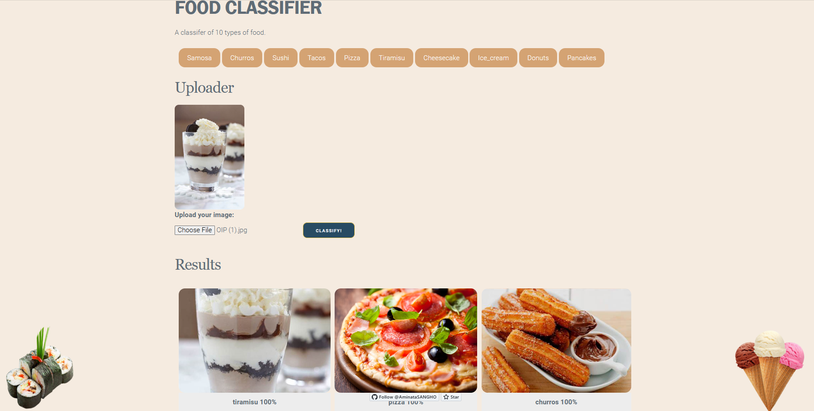

# Food Classification App .

## Description
Food Classification App using Deep Learning with PyTorch and FastAPI in Docker to classifie 10 types of food which are 'samosa','churros','sushi','tacos','pizza','tiramisu','cheesecake','ice_cream','donuts','pancakes' just by uploading from local.

## Tools used
This was built with PyTorch/FastAI for the Deep Learning part and Flask as a Webserver.  
For containerization and easy deployment I use Docker.  
The dataset in use is the Food-101 Dataset but I only use 10 of the foods contained there.

## Demo
Before classification 

After some classifications  

## Installation
- Clone the repository
`git clone https://github.com/yourusername/food-classification-app.git`

- Change into the project directory
`cd food-classification-app`

- Install dependencies
`pip install -r requirements.txt`

- Launch Docker container
`docker build -t food_classifier . && docker run --rm -it -p 5000:5000 food_classifier`
